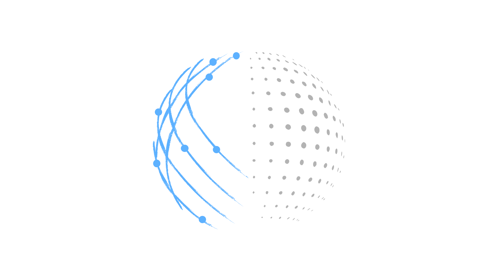
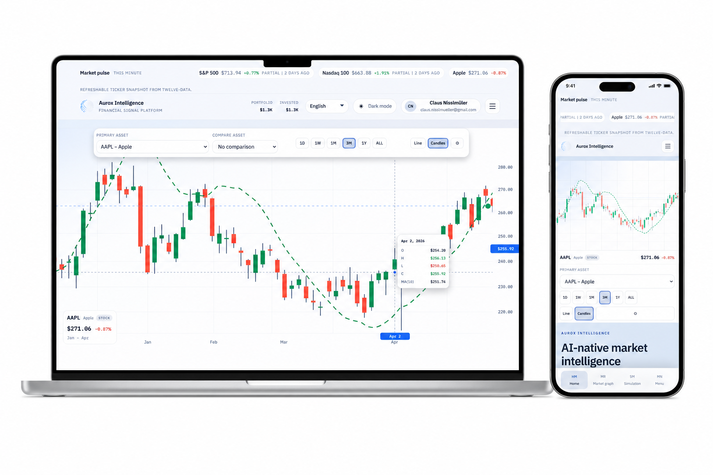
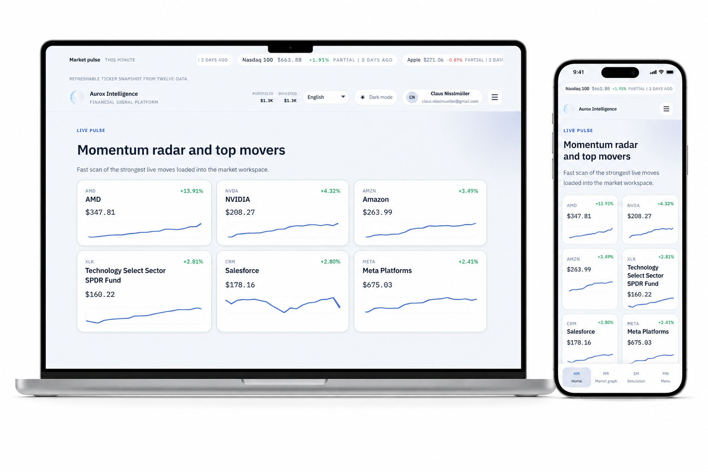
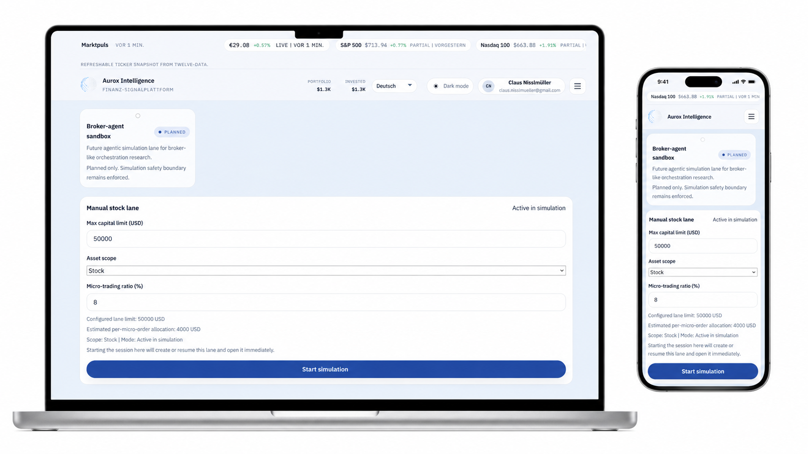
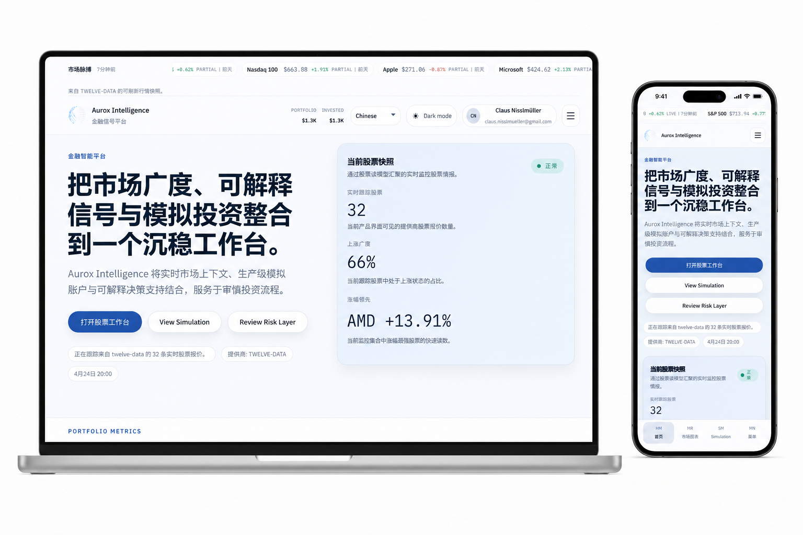

<p align="center">
  
</p>

<h1 align="center">Aurox Intelligence</h1>

<p align="center">
  Simulation-first financial intelligence platform — market data · explainable signals · deterministic simulation trading
</p>

<p align="center">
  
</p>

---

## Table of Contents

- [System Purpose](#system-purpose)
- [Current Product Surfaces](#current-product-surfaces)
- [Monorepo Structure](#monorepo-structure)
- [Non-Negotiable Architecture Boundaries](#non-negotiable-architecture-boundaries)
- [Read and Write Patterns](#read-and-write-patterns)
- [Prerequisites](#prerequisites)
- [Quick Start](#quick-start)
- [Environment Variables](#environment-variables)
- [Development Commands](#development-commands)
- [Testing and Validation Workflow](#testing-and-validation-workflow)
- [Simulation and Execution Safety](#simulation-and-execution-safety)
- [Performance and Debugging Tips](#performance-and-debugging-tips)
- [Docs Map](#docs-map)
- [Known Baseline Issue](#known-baseline-issue)
- [Contribution Checklist](#contribution-checklist)
- [Troubleshooting](#troubleshooting)

---

## System Purpose

Aurox Intelligence is designed to:
- aggregate provider-backed market context
- compute deterministic signals and forecast context
- run auditable simulation trading across stocks, ETFs, and crypto
- expose route-driven, typed read models for workstation UI flows

Safety and correctness take priority over convenience:
1. Safety
2. Correctness
3. Determinism
4. Observability
5. Performance

---

## Current Product Surfaces

<p align="center">
  
</p>

Web routes include:
- `/dashboard`
- `/market`
- `/markets/rankings`
- `/stocks`, `/stocks/[symbol]`
- `/fx`, `/fx/[pair]`
- `/signals`
- `/forecasts`
- `/portfolio`
- `/invest`
- `/invest/overview`
- `/invest/simulation`
- `/invest/portfolio`
- `/invest/orders`
- `/invest/live-readiness`
- `/invest/accounts`
- `/invest/broker-health`
- `/invest/broker-modes`
- `/invest/stocks`, `/invest/etfs`, `/invest/crypto`
- `/admin`, `/admin/monitoring`
- `/account`, `/account/profile`, `/account/settings`, `/account/activity`
- `/login`, `/signup`

---

## Simulation and Lane Configuration

<p align="center">
  
</p>

Simulation is the default execution target. Lanes define capital limits, asset scope, and execution policy per strategy. Live execution is gated behind a readiness check.

---

## Monorepo Structure

```text
apps/
  web/                         # Next.js App Router UI + server orchestration
  worker/                      # Background worker runtime

packages/
  api-contracts/               # Zod schemas and shared contracts
  db/                          # SQL repositories, migrations, read models
  ingestion/                   # Canonicalization + ingestion lifecycle
  providers/                   # External data provider adapters
  signals/                     # Pure signal logic (no I/O)
  forecasting/                 # Pure forecast logic (no I/O)
  agents/                      # Execution and orchestration workflows
  ai-market-intelligence/      # Explainable market intelligence helpers
  observability/               # Logging/telemetry scaffolding
  design-tokens/               # Shared tokens/CSS themes
```

---

## Knowledge Architecture

Aurox is backed by a structured knowledge base that maps financial domains, signal frameworks, and system architecture into a connected graph. The knowledge engine powers explainability across signals, recommendations, and risk decisions.

<p align="center">
  
</p>

<p align="center">
  
</p>

<p align="center">
  
</p>

---

## Localization

The platform is localized across multiple languages. All financial UI labels, risk copy, and signal explanations are translation-ready.

<p align="center">
  
</p>

---

## Non-Negotiable Architecture Boundaries

- `packages/providers` owns all external provider calls.
- `packages/db` is the only SQL/persistence boundary.
- `packages/api-contracts` is the contract source of truth.
- `packages/signals` and `packages/forecasting` stay pure.
- `apps/web` orchestrates routes/services/mappers/UI only.

Forbidden:
- provider calls in UI components
- direct SQL in routes/components
- duplicated contract schemas in app layer
- execution or risk logic in presentation components

---

## Read and Write Patterns

Canonical read path:

`Query -> Mapper -> Service -> Route -> UI`

Canonical write path:

`UI -> Server Action -> Zod Validation -> Domain Service -> Repository Transaction -> Revalidation`

Keep these seams explicit when adding or changing features.

---

## Prerequisites

- Node.js `20+` recommended
- `pnpm` (repo uses `pnpm@10`)
- PostgreSQL for full repository-backed behavior

---

## Quick Start

1. Install dependencies

```bash
pnpm install
```

2. Create local env

```bash
cp .env.example .env
```

Windows PowerShell:

```powershell
Copy-Item .env.example .env
```

3. Run DB migrations

```bash
node packages/db/scripts/migrate.mjs
```

4. Start development

```bash
pnpm dev
```

5. Open the app

- `http://localhost:3000`

---

## Environment Variables

See `.env.example` for complete list. Key groups:

- Core app/runtime:
  - `NODE_ENV`
  - `APP_BASE_URL`
  - `NEXT_PUBLIC_APP_URL`
  - `AUTH_SECRET`
- Database:
  - `DATABASE_URL`
  - `DATABASE_URL_UNPOOLED`
  - `DIRECT_URL`
- Providers:
  - `MARKET_DATA_PROVIDER`
  - `MARKET_HISTORY_FALLBACK_PROVIDERS`
  - `MARKET_QUOTE_FALLBACK_PROVIDERS`
  - Provider API keys (`POLYGON_API_KEY`, `FINNHUB_API_KEY`, etc.)
- Broker execution safety:
  - `BROKER_EXECUTION_PROVIDER` (defaults to `simulation`)
  - `BROKER_DRY_RUN`
  - `BROKER_SANDBOX_MODE`
  - `BROKER_ALLOWED_LIVE_MODE_IDS`

Important:
- Never commit secrets or `.env` files.
- Keep simulation defaults unless live readiness is explicitly approved.

---

## Development Commands

Root:

```bash
pnpm dev
pnpm build
pnpm typecheck
pnpm test
pnpm lint
pnpm clean
```

Targeted:

```bash
pnpm dev:web
pnpm build:web
pnpm typecheck:web

pnpm dev:worker
pnpm build:worker
pnpm typecheck:worker
```

Package-level examples:

```bash
pnpm --filter @repo/api-contracts typecheck
pnpm --filter @repo/db typecheck
pnpm --filter @repo/ingestion typecheck
pnpm --filter @repo/providers test
```

---

## Testing and Validation Workflow

When changing code, prefer smallest meaningful validation first.

Typical flow:
1. Run targeted package checks for touched areas.
2. Run `pnpm build:web` for route/UI/server changes.
3. Escalate to broader checks only when needed.

Suggested minimums by change type:
- Contracts changed:
  - `pnpm --filter @repo/api-contracts typecheck`
- DB/repository changed:
  - `node packages/db/scripts/migrate.mjs`
  - `pnpm --filter @repo/db typecheck`
- Provider logic changed:
  - `pnpm --filter @repo/providers typecheck`
  - `pnpm --filter @repo/providers test`
- Dashboard/web route changed:
  - `pnpm build:web`

---

## Simulation and Execution Safety

Simulation is the default execution mode.

Key expectations:
- deterministic accounting and order lifecycle
- transaction and snapshot auditability
- explicit risk and policy gates before any execution
- safe fallback behavior when provider or data paths degrade

Do not:
- bypass risk checks
- fake provider data
- enable autonomous live execution without readiness gates

Simulation persistence tables include:
- `app.simulation_accounts`
- `app.simulation_portfolios`
- `app.simulation_positions`
- `app.simulation_orders`
- `app.simulation_transactions`
- `app.simulation_snapshots`

---

## Performance and Debugging Tips

- Prefer targeted query/service timings in development (`NODE_ENV=development`).
- Avoid adding expensive calls to broad routes (`/dashboard`) unless needed for initial shell.
- Use streaming boundaries and request-scoped dedupe for heavy sections.
- Cache only non-user-specific data globally; keep user-specific reads request-scoped.
- Watch `.next/dev/logs/next-development.log` for route timing and warning context.

For bottleneck analysis on dashboard-like pages:
1. instrument loader/query/service timing
2. identify dominant path (provider breadth, DB read model, history)
3. apply one focused optimization
4. re-measure and compare

---

## Docs Map

Primary entry points:
- [System Docs Master](./DOCUMENTATION.md)
- [Current State Summary](./CURRENT_STATE_SUMMARY.md)
- [Architecture Overview](./docs/architecture/overview.md)
- [Architecture Current State](./docs/architecture/current-state.md)
- [Architecture Best Practices](./docs/architecture/best-practices.md)
- [Simulation Test Plan](./docs/simulation-test-plan.md)

Domain docs:
- [Finance System Overview](./docs/finance-system-overview.md)
- [Signal Framework](./docs/signal-framework.md)
- [Risk Management](./docs/risk-management.md)
- [Execution Layer](./docs/execution-layer.md)
- [Portfolio Construction](./docs/portfolio-construction.md)
- [Reporting Framework](./docs/reporting-framework.md)
- [Broker Infrastructure](./docs/broker-infrastructure.md)
- [AI in Finance](./docs/ai-in-finance.md)

Live microtrading docs:
- [Overview](./docs/live-microtrading/overview.md)
- [Readiness Checklist](./docs/live-microtrading/readiness-checklist.md)
- [Risk Policy and Guards](./docs/live-microtrading/risk-policy-and-guards.md)
- [Incident Response and Kill Switch](./docs/live-microtrading/incident-response-and-kill-switch.md)

---

## Known Baseline Issue

As of `2026-04-25`, `pnpm --filter @repo/web typecheck` currently fails with existing issues in:

- `apps/web/components/signals/signal-score-badge.tsx`
- `apps/web/server/auth/service.test.ts`
- `packages/agents/src/execution/execution-mode-registry.ts`

Treat these as baseline unless your change directly touches those areas. Verified passing on the same date:
- `pnpm --filter @repo/api-contracts typecheck`
- `pnpm --filter @repo/db typecheck`

---

## Contribution Checklist

Before opening a PR:
- confirm boundaries are preserved (`providers`, `db`, `api-contracts`, etc.)
- keep changes scoped and reversible
- run targeted validation commands
- include any migration/risk implications in notes
- call out residual risks and follow-up tasks

PR summary should include:
- what changed
- why it changed
- commands run
- known unrelated failures
- rollback approach (if relevant)

---

## Troubleshooting

### EPERM / sandbox / path errors when running scripts

If command execution fails with filesystem permission errors, rerun outside restrictive sandbox or from a shell with proper workspace permissions.

### Port already in use (Next dev)

If you see "another next dev server is already running":
- stop the existing process or choose another port
- on Windows: `taskkill /PID <pid> /F`

### Slow dashboard route

Start by measuring loaders in development logs, then optimize the single slowest path. Typical hotspots:
- broad quote universe fetches
- expensive provider history reads
- DB read model cold path latency

### Favicon/logo not updating

Browser favicon caches aggressively:
- hard refresh
- clear site data
- verify file in `apps/web/public/` and metadata icon config
